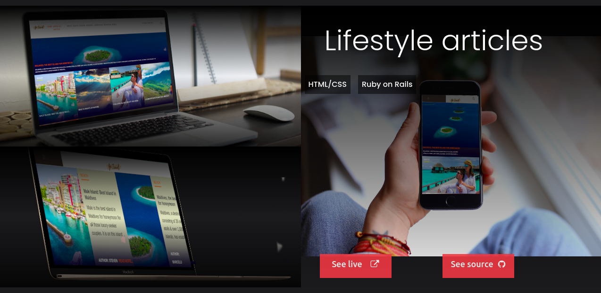

# Portfolio

Portfolio made following the Microverse's template where I could showcase all my projects and knowledge achieved during the HTML, CSS, Ruby, and Ruby on Rails Curriculum



## Built With

- HTML
- CSS

## Live Demo

[Portfolio](https://marcelomaidden.github.io/portfolio)


## Getting Started

To get a local copy up and running follow these simple example steps.

## Clone the repository

```
   git clone https://github.com/marcelomaidden/portfolio.git
   cd portfolio
```

### Usage

Open index.html in your browser.

👤 **Marcelo Fernandes**

- GitHub: [@marcelomaidden](https://github.com/marcelomaidden)
- Twitter: [@marcelomaidden](https://twitter.com/marcelomaidden)
- LinkedIn: [Marcelo Fernandes](https://linkedin.com/in/marcelofernandesdearaujo)

## Acknowledments
- Microverse team for providing amazing design templates for portfolio.
- Unsplash
- Graphicburger
- Pexels
- Font Awesome
- W3schools
- Twitter Boostrap
- Google Fonts
- Cottonbro photos available on Pexels
- Luis Quintero photos available on Pexels

## 🤝 Contributing

Contributions, issues and feature requests are welcome!

Feel free to check the [issues page](https://github.com/marcelomaidden/portfolio/issues/).

## Show your support

Give a ⭐️ if you like this project!
